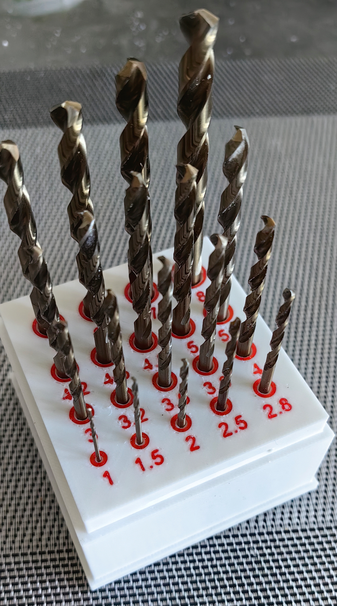
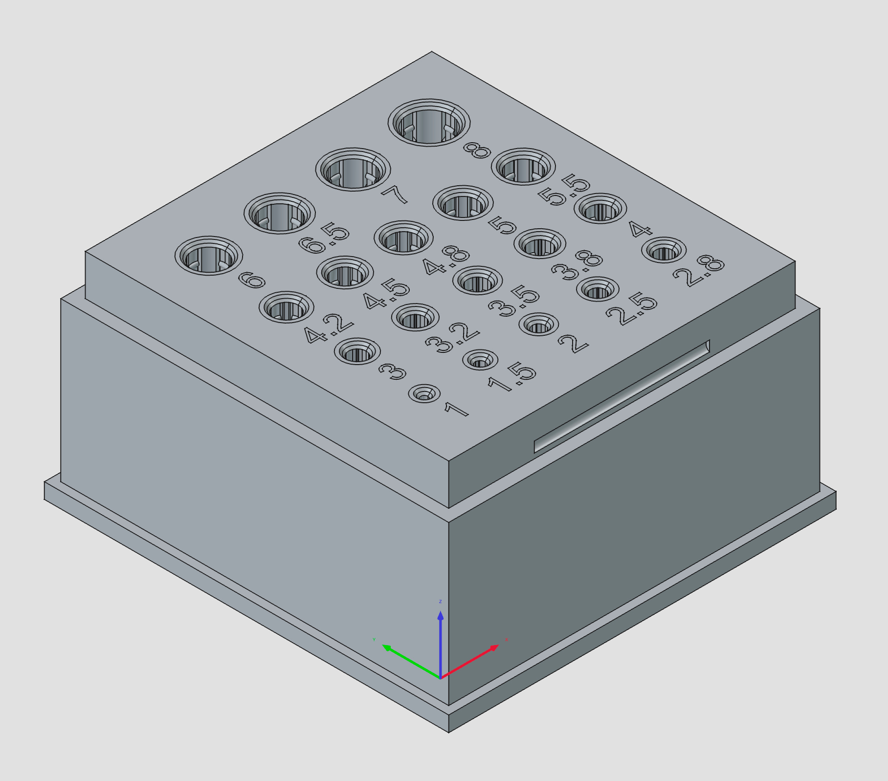
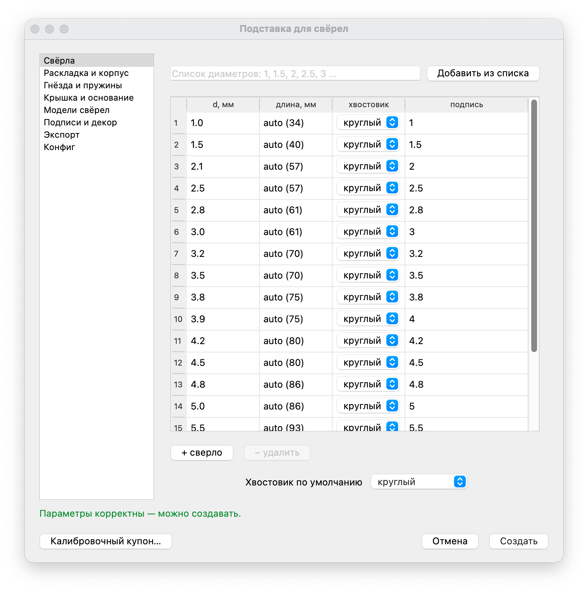

# drill-holder — параметрическая подставка для свёрел (FreeCAD)

Генерирует 3D-модель подставки для хранения свёрел по набору хвостовиков (диаметр, длина, тип)
и экспортирует её в `.FCStd`, `.STL` и `.STEP`. Свёрла удерживаются печатными листовыми
пружинами-детентами в стенках гнёзд, чтобы не болтались. Поддерживаются круглые и шестигранные
(hex) хвостовики, опциональные крышка-колпак и устойчивое основание.





## Возможности

- Гнёзда под **круглые** (по диаметру сверла) и **шестигранные** (`hex`) хвостовики. Hex-гнездо
  шестигранное, по **стандартному** размеру «под ключ» (`socket.hex_size`, по умолчанию 1/4");
  диаметр сверла на hex-гнездо не влияет — только на подпись.
- **Листовые пружины-детенты** в стенке гнезда (и круглого, и hex): продольные пропилы выделяют
  балку-лепесток, посередине — утолщение внутрь к хвостовику; 1–2 пружины по длине удерживают
  сверло по оси (без покупных деталей), чтобы оно **не выпадало**. У круглого лепестки идут по
  окружности, у hex — на гранях призмы (грань держит от проворота, детент — от выпадания; детентов
  не больше 6 граней). Если не помещаются — число авто-уменьшается.
- Раскладка: **ряд**, **сетка**, **наклонная** подставка или **auto** (выбор по набору свёрел).
  Раскладка **адаптивная**: шаг — по реальным размерам гнёзд (мелкое сверло не занимает место
  крупного), а высота каждого ряда сетки — по самому крупному гнезду в нём. В режиме **grid** ряды
  центрируются по общей оси и растягиваются на общую ширину равными промежутками вокруг гнёзд (как
  CSS flex `space-around`). Упаковка учитывает и **место под подписи**: вынос текста за гнездо
  резервируется и между рядами, и внутри ряда, и в габарите корпуса — подписи не налезают на
  соседние гнёзда. Выравнивание `align` (`center`/`front`/`back`) работает в обоих режимах —
  по вертикали внутри каждого ряда. Флаг `layout.serpentine` раскладывает сетку **«змейкой»**:
  нечётные ряды разворачиваются (слева направо → справа налево). Свёрла отсортированы по размеру,
  поэтому змейка делает их размерный ряд непрерывным — конец ряда и начало следующего оказываются
  соседями по вертикали (без скачка размера на переносе). Габарит корпуса при этом тот же, что у
  обычной сетки, — это про удобство поиска сверла, а не про уменьшение размера.
- Глубина гнезда — **доля от длины сверла** (с ограничением min/max).
- **Крышка-колпак** над свёрлами: съёмная или откидная (на боковых осях корпуса).
- **Устойчивое основание**: ручное (вынос плиты) или авто (по центру тяжести и высоте свёрел).
- Опциональные **подписи** диаметров — гравировкой (вырез вглубь) или выдавливанием (рельеф
  наружу); с выбранной стороны отверстия, отступ от его края или от центра.
- Опциональные **3D-модели свёрел** (`drill_geometry`, по умолчанию выкл) — со спиральной режущей
  частью или гладким цилиндром без канавок (`style`), с коническим кончиком и хвостовиком, собранные
  в отдельную деталь `Drills` (не сливается с корпусом). Для визуализации набора в подставке;
  печатать эту деталь не нужно.
- Экспорт в любой набор форматов: `FCStd`, `STL`, `STEP` (детали — отдельными файлами).

## Установка

Нужен только **FreeCAD ≥ 1.0** (проверено на 1.2). Сторонних библиотек нет.
`freecadcmd` лежит внутри приложения, например на macOS:

```
/Applications/FreeCAD.app/Contents/Resources/bin/freecadcmd
```

## Быстрый старт

1. Откройте `holder_config.py` и впишите свои свёрла и параметры (файл подробно прокомментирован).
2. Запустите сборку через launcher `./drill-holder` — он сам находит `freecadcmd`:

```bash
./drill-holder                 # holder_config.py рядом со скриптом + диалог правки (по умолчанию)
./drill-holder my_drills.py    # свой конфиг + диалог
./drill-holder --no-gui        # собрать сразу по конфигу, без диалога (скрипты/headless)
```

По умолчанию открывается Qt-диалог правки (см. ниже). Для скриптовой/пакетной сборки добавьте
`--no-gui` — тогда модель строится сразу по конфигу.

**Windows.** Тот же запуск — обёртками `drill-holder.cmd` (cmd) и `drill-holder.ps1` (PowerShell);
аргументы те же, freecadcmd ищется в `PATH` и в `C:\Program Files\FreeCAD*\bin`:

```bat
drill-holder.cmd --no-gui              REM из cmd.exe
.\drill-holder.ps1 my_drills.py        # из PowerShell
```

Путь к freecadcmd при необходимости задаётся переменной `FREECADCMD` (`set FREECADCMD=...` в cmd,
`$env:FREECADCMD='...'` в PowerShell). Bash-launcher `./drill-holder` тоже работает под Git Bash/MSYS.

Launcher ищет `freecadcmd` в `PATH` и типовых местах установки (в т.ч. внутри
`FreeCAD.app` на macOS). Если нашёлся не тот / не нашёлся — укажите путь явно:

```bash
FREECADCMD="/Applications/FreeCAD.app/Contents/Resources/bin/freecadcmd" ./drill-holder
```

Появятся файлы `drill_holder.FCStd`, `drill_holder.stl`, `drill_holder.step`
(имя и каталог задаются в `output`; при крышке детали пишутся по отдельному файлу).

> Запуск напрямую тоже работает: `freecadcmd build_holder.py holder_config.py`.

### Диалог правки (по умолчанию)

При запуске без `--no-gui` открывается Qt-диалог, предзаполненный из `holder_config.py`. Форма
покрывает **каждый** параметр конфига и разложена на 5 смысловых вкладок:

- **Свёрла** — таблица свёрел (Ø/длина/хвостовик/подпись) + хвостовик по умолчанию для новых строк.
  Удобства таблицы:
  - **массовый ввод**: вставьте список диаметров через запятую/пробел (`1, 1.5, 2, 2.5, 3 …`) в
    поле над таблицей и нажмите «Добавить из списка» — они допишутся строками (с авто-длиной,
    подписью и хвостовиком по умолчанию), отсортированные по возрастанию; дубликаты сохраняются,
    нераспознанные куски пропускаются с сообщением;
  - длина по умолчанию — `auto`: при вводе диаметра ячейка показывает `auto (N)`, где `N` —
    стандартная длина по DIN 338 (в конфиг при этом сохраняется именно `"auto"`); можно ввести
    и конкретное число — оно не будет затёрто;
  - **подпись** формируется из диаметра сразу после его ввода, если поле подписи пустое;
  - кнопка «– удалить» активна только при выделенной строке.
- **Раскладка и корпус**, **Гнёзда и пружины**, **Крышка и основание**, **Подписи и экспорт** —
  все остальные параметры по секциям. У каждого поля — подсказка (tooltip) с пояснением;
  **шрифт** задаётся именем системного шрифта (кнопка «Система…») или путём к файлу («Файл…»).
- **Конфиг** — read-only превью сгенерированного `holder_config.py` (что именно уйдёт в сборку).

**Зависимости параметров — вживую.** Неприменимое при текущих значениях поле **дизейблится**
(напр. угол наклона — только для раскладки `angled`; параметры крышки — недоступны для `angled`;
тело пружин — при выключенных пружинах) с пояснением в подсказке. Недопустимое значение
**подсвечивается** красным с сообщением «почему + совет». Пока конфиг невалиден, кнопка
«**Создать**» неактивна, а внизу показана причина.

По «**Создать**» текущая форма **записывается** в `holder_config.py` (через `render_config`,
с комментариями-документацией) и по ней же строится модель — файл и сборка всегда отражают
текущие значения. Отмена ничего не пишет.

Кнопка «**Калибровочный купон…**» собирает не подставку, а тестовую деталь для подбора
`socket.clearance` под ваш принтер (та же гребёнка гнёзд, что и `calibration.py`, см.
[Посадка свёрел и калибровка зазора](#посадка-свёрел-и-калибровка-зазора)). Ваш конфиг и
`holder_config.py` при этом **не меняются**.

Диалог работает двумя путями:

- **Из командной строки** (по умолчанию): `freecadcmd` сам поднимает Qt-окно. Если дисплея нет
  (например, CI с `QT_QPA_PLATFORM=offscreen`), окно показать нельзя — сборка идёт по конфигу
  с предупреждением. Для заведомо безоконной сборки используйте `--no-gui`.
- **Как макрос в FreeCAD**: откройте `build_holder.py` в FreeCAD (меню *Macro*) и запустите —
  диалог появится автоматически.

## Конфигурация

Единственный источник истины — `holder_config.py` (обычный Python-файл с dict `CONFIG`).
Каждый параметр снабжён комментарием. Любой пропущенный ключ берётся из значений по умолчанию
(`drillholder/config.py: DEFAULTS`). Ключевые блоки:

| Блок            | Что задаёт                                                                 |
|-----------------|---------------------------------------------------------------------------|
| `default_shank` | тип хвостовика по умолчанию (`round`/`hex`)                                |
| `drills`        | список свёрел: `d`, `length` (число или `"auto"`/опустить), опц. `shank`, `label` |
| `socket`        | зазоры, глубина (доля длины), пределы глубины, размер/зазор/ориентация hex |
| `springs`       | листовые пружины: число, ряды, размеры лепестка/пропилов, детент           |
| `layout`        | режим (`auto`/`row`/`grid`/`angled`), сетка «змейкой» (`serpentine`), угол наклона, шаги, отступы, выравнивание ряда (`align`: `center`/`front`/`back`) |
| `base`          | толщина дна и минимальная высота корпуса                                   |
| `lid`           | крышка: `none`/`removable`/`hinged`, стенки, зазоры, оси/защёлка           |
| `foot`          | основание: `none`/`manual`/`auto`, толщина, вынос, угол опрокидывания      |
| `labels`        | подписи: вкл/выкл, режим (гравировка/выдавливание), положение, привязка, размер, шрифт, многоцветная печать |
| `rings`         | декоративные колечки вокруг гнёзд: вкл/выкл, ширина, глубина, зазор от отверстия |
| `output`        | каталог, имя, набор форматов, точность меша STL                           |

> Для `hex` гнездо шестигранное и берётся из `socket.hex_size` (стандарт «под ключ», 6.35 = 1/4");
> поле `d` у hex — диаметр сверла, влияет только на подпись. `shank` у сверла указывают только
> если он отличается от `default_shank`.
> `labels.mode` — `engrave` (текст вырезается вглубь грани на `depth`) или `emboss` (текст
> выступает рельефом наружу на `depth`); для выдавливания закладывайте зазор до соседей и крышки.
> `labels.position` — сторона от отверстия (`front`/`back`/`left`/`right`); `labels.reference` —
> откуда отсчитывается отступ: `edge` (от края отверстия — зазор `offset` одинаков при любом
> размере гнезда) или `center` (от центра отверстия — подписи на фиксированном расстоянии от
> центра выстраиваются ровно даже в сетке с гнёздами разного размера).
> `labels.font` принимает **имя системного шрифта** (`Arial`, `DejaVu Sans` — ищется файл в
> системных каталогах) или **путь к файлу** .ttf/.otf. Если пусто — берётся первый доступный
> системный шрифт (это штатное «авто», без предупреждения). Жёлтое предупреждение появляется,
> только если запрошенный шрифт не найден; подписи пропускаются, лишь если шрифтов нет вообще.
> `labels.multicolor` — для мультиматериального принтера (QIDI BOX и т.п.): подписи выводятся
> отдельной деталью `Labels`, а в корпусе вырезается посадочное место под текст (и для гравировки,
> и для выдавливания). Загрузите `<name>_holder.*` и `<name>_labels.*` в слайсер как один объект и
> назначьте им разные филаменты — получите надписи другим цветом. Выключено — текст слит с корпусом
> одним цветом.
> `rings` — декоративные колечки-инкрустации вокруг гнёзд (чистая косметика, на посадку сверла не
> влияют). Вокруг каждого гнезда в верхнюю грань заподлицо утоплено плоское кольцо шириной
> `rings.width` и глубиной `rings.depth`; внутренняя кромка отсчитывается от самого отверстия
> (с зазором `rings.gap`), поэтому кольцо облегает дырку, а не внешний край ниш пружин. Кольца
> выводятся отдельной деталью `Rings` под печать вторым пластиком (тем же, что и подписи): в
> корпусе под них вырезаются выемки, в слайсере `<name>_rings.*` загружают вместе с
> `<name>_holder.*` как один объект и назначают кольцам другой филамент. Раскладка автоматически
> резервирует место под ширину колец, чтобы они не наезжали на соседей.
> Крышка поддерживается только для прямых раскладок (не `angled`). При нескольких деталях
> STL/STEP пишутся по файлу на деталь (`<name>_holder.*`, `<name>_labels.*`, `<name>_rings.*`,
> `<name>_lid.*`).

## Архитектура

Код разбит на модули по принципу Clean Architecture (Dependency Rule): чистое ядро не зависит
от FreeCAD и тестируется обычным Python; вызовы FreeCAD изолированы в адаптерах.

```
holder_config.py        # конфиг (данные, правится вручную)
build_holder.py         # точка входа: связывает слои
drillholder/
  model.py              # ядро: Value Objects (dataclasses) и Enums
  config.py             # ядро: загрузка, слияние с дефолтами, валидация
  layout.py             # ядро: расчёт раскладки и глубин (чистая математика)
  lengths.py            # ядро: справочник стандартных длин свёрел (DIN 338)
  fonts.py              # ядро: подбор системного шрифта для подписей
  geometry/             # адаптер к FreeCAD (единственное место с import Part/Draft/Mesh)
    base.py             #   корпус (прямой блок / клин)
    socket.py           #   гнездо + листовые пружины-детенты (round/hex)
    labels.py           #   гравировка подписей
    foot.py             #   устойчивое основание (manual/auto по центру тяжести)
    lid.py              #   крышка-колпак (съёмная/откидная)
    assembly.py         #   сборка: корпус − гнёзда − подписи + основание + крышка
  export.py             # адаптер: запись FCStd/STL/STEP
  gui/                  # опциональный PySide-диалог правки (форма на все параметры)
    fields.py           #   ядро: декларации полей (без Qt)
    dependencies.py     #   ядро: применимость/валидность/проверка (без Qt)
    widgets.py          #   Qt-виджеты полей
    drill_table.py      #   Qt-таблица свёрел
    preview.py          #   Qt read-only превью конфига
    dialog.py           #   Qt-диалог + show_dialog
  gui_highlighter.py    # подсветка синтаксиса превью (Qt)
tests/                  # тесты ядра — без FreeCAD
```

## Тесты

Чистые слои (`model`/`config`/`layout`) тестируются без FreeCAD:

```bash
python3 -m pytest tests/ -q
```

Геометрию и экспорт проверяйте сборкой через `freecadcmd` (см. выше) и открытием `.FCStd`
в FreeCAD.

## Подсказки по печати (FDM)

### Посадка свёрел и калибровка зазора

Бор гнезда — **свободная посадка** (сверло проскальзывает), а удерживают его от выпадания
**детенты-пружины** (осевая фиксация). Это сознательное разделение: бор не должен зажимать
сверло трением, иначе мелкие свёрла клинит.

FDM печатает отверстия **меньше номинала** (усадка + раздув бисера на тугих радиусах — на ~0.2–0.4 мм
по Ø), и величина у каждого принтера/пластика/потока своя — её **нельзя зашить в модель**. Поэтому
зазор вынесен в один параметр `socket.clearance` (радиальный, дефолт 0.20 мм — типичный FDM-зазор
свободной посадки) и калибруется под вашу машину:

- **Мелкие свёрла не лезут / входят с клином** → поднимите `socket.clearance` шагом 0.05.
- **Свёрла болтаются в боре** (до защёлкивания детентов) → опустите `socket.clearance`.
- Поднимая `clearance`, при желании поднимите и `springs.bump_protrusion` на столько же — чтобы
  сохранить силу зажима детента (≈ `bump_protrusion − clearance`).

Точную цифру даёт **калибровочный купон** `calibration.py` — гребёнка гнёзд под несколько реальных
свёрел, раскатанная по зазорам (пружины выкл, подписи вида «3·20» = сверло 3 мм, зазор 0.20):

```bash
./drill-holder --no-gui calibration.py    # печать ~10–15 мин, мало пластика
```

Вставьте реальное сверло каждого размера, найдите минимальный зазор без клина и без люфта,
впишите его в `socket.clearance`. Размеры свёрел и шаг зазоров правятся вверху `calibration.py`.

### Пружины-детенты

- `springs.slot_width` держите ≥ диаметра сопла (обычно ≥ 0.6–0.8 мм).
- Сила зажима ≈ `springs.bump_protrusion − socket.clearance`; начните с дефолтов и калибруйте.
  Мягче вход — больше `springs.bump_radius`; мягче пружина — длиннее `leaf_length` или тоньше
  `leaf_thickness`.
- Для тонких/мелких свёрел пружины могут не помещаться по окружности/глубине — тогда сборка
  **сама уменьшает** `count`/`rows` до влезающего и пишет жёлтое предупреждение (а не падает).
  Хард-ошибка — только если не лезет даже одна пружина/один ряд (уменьшите `springs.leaf_width`/
  `leaf_length`/`slot_width`, увеличьте диаметр/глубину или выключите `springs.enabled`).
- Крышка: подбирайте `lid.clearance` под усадку принтера; для откидной важен `lid.hinge_clearance`
  (зазор отверстие/ось) — обычно 0.3–0.5 мм.
